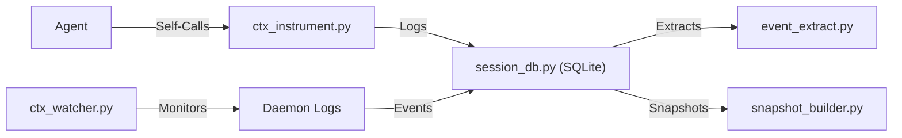

# Antigravity Context-Mode Support

This directory contains a suite of Python scripts that bring `context-mode` efficiency to **Antigravity** (a standalone AI coding environment).

## The Challenge

Antigravity operates as a standalone Electron application without a public plugin or hook API. This makes traditional automatic instrumentation (like TypeScript-based MCP hooks) impossible.

## The Solution: Self-Instrumentation

We use a "Manual Hook" approach. The AI agent proactively calls these scripts via `run_command` to:
1.  **Summarize context** before tool usage (Pre-processing).
2.  **Log events** to a persistent SQLite store (Instrumentation).
3.  **Detect compaction** and restore session state (Continuity).

## Project Structure

| Script | Purpose |
|--------|---------|
| `ctx_read.py` | Smart file reader with intent filtering and structure extraction. |
| `ctx_dir.py` | Compact directory tree renderer. |
| `ctx_summary.py` | Pipe-friendly text summarizer for command outputs. |
| `session_db.py` | SQLite persistent store for session events. |
| `event_extract.py` | Maps tool calls to `context-mode` event categories. |
| `snapshot_builder.py` | Priority-tiered snapshot builder for session resume. |
| `ctx_instrument.py` | The main "manual hook" entry point. |
| `ctx_doctor.py` | Diagnostic tool to verify system health. |
| `ctx_watcher.py` | Passive monitor for daemon logs and conversation growth. |
| `ctx_session.py` | Continuity manager (save, restore, handoff). |

## Installation

1.  Copy this `antigravity` directory to your project (e.g., `scripts/antigravity`).
2.  Verify the environment:
    ```bash
    python ctx_doctor.py
    ```
3.  Instruct the agent to use these scripts by adding them to your `AGENTS.md` or user rules.

## Example User Rules

```markdown
# Context-Mode Hook Protocol
When context is tight or sessions are long, use the `ctx_efficient` workflow:
1. BEFORE a major tool call: `python ctx_instrument.py pre <tool> <input>`
2. FOR Large Files: `python ctx_read.py <path> --intent <goal>`
3. FOR Large Dirs: `python ctx_dir.py <path> --depth 2`
4. AFTER a tool call: `python ctx_instrument.py post <tool> <input> --output-size <raw> --context-size <used>`
```

## Architecture


